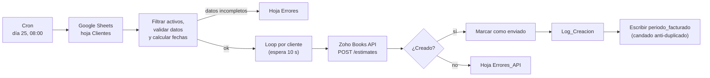

# Generación automática de remitos en Zoho Books

Automatización en producción desde marzo de 2026 para Berta, agencia de marketing de Leones, Córdoba.
Cada mes genera y envía los remitos de todos los clientes activos en Zoho Books a partir de una planilla de Google Sheets, sin que nadie toque nada.

| Métrica | Valor |
|---------|-------|
| Remitos por mes | ~29 |
| Remitos generados desde que está en producción | más de 200 |
| Tiempo por corrida | ~8 minutos (incluye espera entre clientes) |
| Trabajo manual que reemplaza | ~2,5 h por mes de carga en Zoho |
| Remitos duplicados | 0 |

## El problema

Berta factura un abono mensual fijo a cada cliente. Todos los meses la administrativa tenía que entrar a Zoho Books, elegir el cliente, cargar monto, descripción y fechas de vencimiento, guardar y marcar como enviado. Una vez por cliente, unas 29 veces por mes.

Era un trabajo repetitivo, con riesgo de errores de tipeo, de olvidarse un cliente o de facturar dos veces el mismo período.

## La solución

Un workflow de n8n que corre solo el **día 25 de cada mes a las 08:00**:

*La captura muestra el nombre original del disparador ("Día 1"); hoy corre el día 25 (ver más abajo).*

## Decisiones técnicas

**Candado anti-duplicado.** Al terminar cada cliente, el workflow escribe el período facturado (por ejemplo `Septiembre de 2026`) en la planilla. Antes de crear un remito compara contra ese campo y, si ya está, lo saltea. Se puede volver a ejecutar el workflow sin riesgo de facturar dos veces.

**Cobro a mes vencido.** El remito factura el mes trabajado, no el que empieza. El cálculo se hace con Luxon: `mesFacturar = today.minus({ months: 1 })`.

**Generación adelantada al día 25.** Originalmente corría el día 1. Se adelantó para que el sistema de cobranza ([automatizacion-cobranzas-whatsapp](https://github.com/rami-fresia/automatizacion-cobranzas-whatsapp)) pudiera mandar un primer aviso 12 días antes del vencimiento: con vencimientos el día 10, ese aviso cae antes de fin de mes, cuando el remito todavía no existía. Para no romper la lógica, el código toma como referencia el día 1 del mes siguiente (`now.plus({ months: 1 }).startOf('month')`), así fechas, descripción y vencimientos quedan iguales que antes. La transición se verificó contra Zoho: cero períodos salteados y cero duplicados.

**Manejo de errores sin cortar la corrida.** Los nodos de Zoho tienen reintentos y `continueRegularOutput`: si falla un cliente, se registra y sigue con el siguiente. Los errores se separan en dos hojas según el origen (datos incompletos en la planilla o rechazo de la API). Además, el workflow tiene asignado un Error Workflow que avisa por mail si algo se rompe fuera de lo previsto.

**Rate limiting.** 10 segundos entre clientes para no chocar con los límites de la API de Zoho.

**Fechas de vencimiento flexibles.** La columna `fecha_vencimiento` acepta un día del mes (`10`), una fecha fija (`15/05/2026`) o vacío (usa la fecha de ejecución).

## Planilla de origen

Hoja **Clientes**:

| Campo | Descripción |
|-------|-------------|
| `contact_id` | ID del cliente en Zoho Books |
| `cliente_nombre` | Nombre del cliente |
| `monto` | Abono mensual |
| `fecha_vencimiento` | Día del mes o fecha fija |
| `activo` | `TRUE` para incluirlo en el ciclo |
| `periodo_facturado` | Último período facturado (candado) |

Hojas de log: **Log_Creacion** (cada remito creado), **Errores** (datos inválidos) y **Errores_API** (respuestas fallidas de Zoho).

## Stack

- **n8n** self-hosted (Docker + EasyPanel en un VPS) como orquestador
- **Zoho Books API v3** con OAuth 2.0
- **Google Sheets** como fuente de datos y log
- **JavaScript** (nodos Code con Luxon) para filtros y cálculo de fechas

## Próximas mejoras

- Idempotencia del lado de Zoho: consultar si ya existe un remito del período antes de crearlo, para cubrir el caso de que se cree el remito pero falle la escritura del candado.
- Comparar el período por mes y año normalizados en lugar de texto exacto.

## Seguridad

Este repositorio no contiene credenciales, IDs de organización, IDs de planillas ni datos de clientes. Las credenciales viven cifradas en el gestor de credenciales de n8n.
